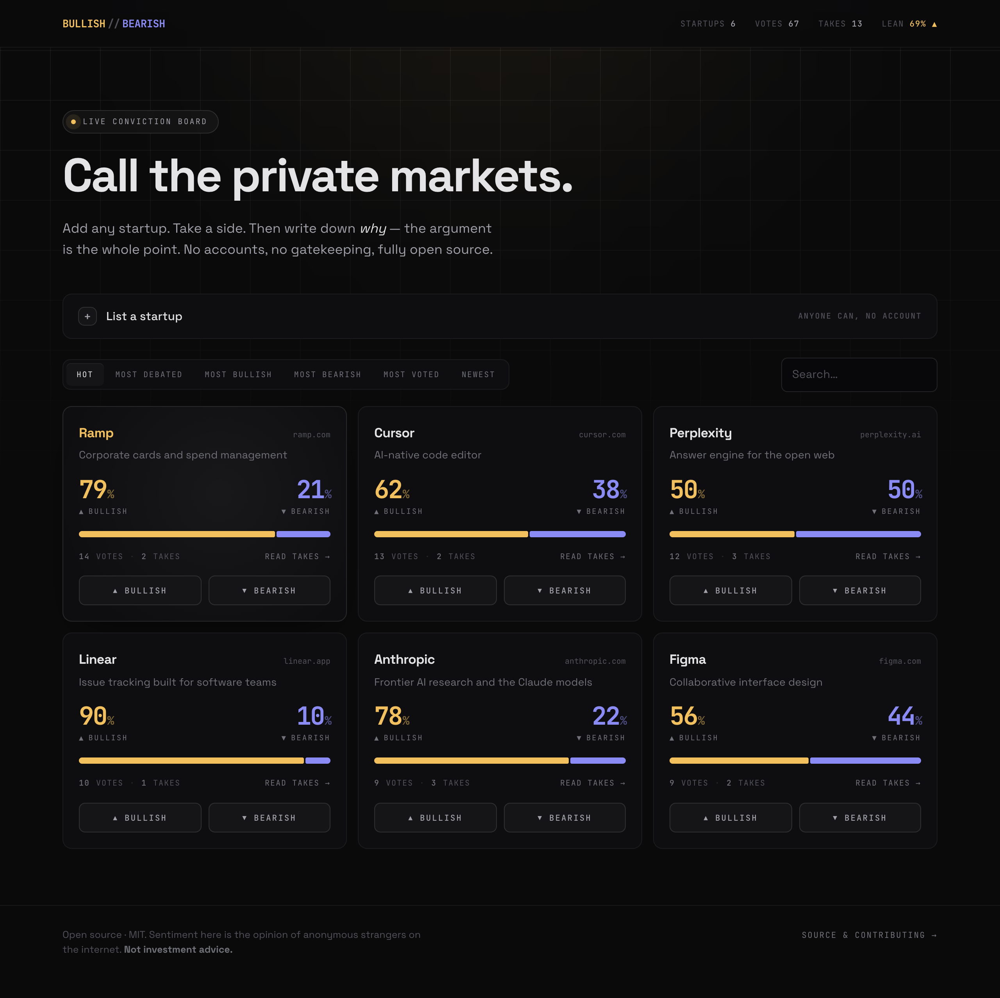

# bullishorbearish.ai

An open board for startup sentiment. Anyone can add a private company, call it
**bullish** or **bearish**, and — the part that actually matters — write down
*why*.

No accounts. No gatekeeping. No algorithmic feed. Just a list of companies, a
split bar showing where the crowd landed, and the arguments on both sides.



## Why this exists

Startup sentiment already gets traded constantly — in group chats, on podcasts,
in replies. It just never gets written down anywhere durable or public. This is
the smallest thing that does that: a permanent, linkable page per company where
the bull case and the bear case sit next to each other.

The vote is the hook. The reasoning is the product.

## Quick start

Needs **Node 22.13 or newer** (for the built-in `node:sqlite` — 22.5 introduced it but kept it behind a flag until 22.13). There are no
native dependencies and no build step.

```bash
git clone https://github.com/MaverickFraser39/bullishorbearish.ai.git
cd bullishorbearish.ai
npm install
npm run seed     # optional: puts a sample board in place
npm run dev      # http://localhost:3000
```

`npm test` runs the suite. `npm start` runs it without the file watcher.

## How it's built

| | |
|---|---|
| Server | Express 5, one file (`server.js`) |
| Storage | SQLite through Node's built-in `node:sqlite` — no `better-sqlite3`, nothing to compile |
| Frontend | Vanilla JS modules and one stylesheet. No framework, no bundler, no build |
| Tests | `node:test` |

```
server.js          HTTP layer: routes, rate limiting, voter fingerprinting
lib/db.js          schema and every query — no SQL lives anywhere else
lib/validate.js    input parsing; nothing reaches the database unvalidated
public/            the whole client — index.html, app.js, styles.css, favicon.svg
scripts/seed.js    sample board
tests/             node:test suite
docs/              images used by this README
```

## Decisions worth knowing about

**It isn't red and green, on purpose.** Every finance product reaches for that
pair, which is exactly why it reads as a template. It also editorialises: red is
the danger colour, and bearish is a legitimate position, not an error. And it
measures worse — plain green/red separates by ΔE 4.1 under deuteranopia against
a passing bar of 8, and even a teal-shifted version only reaches 11.2.

The live pair is gold `#f2c05c` against indigo `#8b8bf5`: warm versus cool, the
classic diverging structure, at **ΔE 30.3** — near three times the separation of
the red/green it replaced. Both clear 3:1 on the surface and read as text at
10.1:1 and 6.7:1. Arrows and written labels carry the result as well, so hue is
never load-bearing alone.

**Restraint is the design.** Colour appears on the figures, the meter, an active
vote and the live dot — nowhere else. There are no glows on the numbers, no
bloom on the bars, no gradient-filled headline and no shimmer. Those were all
there in an earlier pass and every one of them made the page look like it was
trying to convince you.

**Motion is decoration, never information.** Entrances, the drifting wash, the
cursor spotlight and the counting figures are ornament. Under
`prefers-reduced-motion` every one is cut and the final state renders
immediately — nothing is withheld.

**Duplicates are the real enemy.** On a board anyone can post to, `OpenAI`,
`Open AI` and `open-ai` become three cards splitting one company's votes. Every
name is reduced to an alphanumeric key (`openai`) that decides identity, while a
separate readable slug (`open-ai`) is what appears in the URL.

**Thin samples don't top the charts.** Ranking uses a Laplace-smoothed ratio,
`(bullish + 1) / (total + 2)`, so a single enthusiastic vote can't outrank a
company sitting at 98% across forty.

**Changing your mind isn't a second vote.** Votes upsert on
`(startup, voter)`. Re-voting rewrites your call rather than stacking another
one. A quick vote from the board sends no `reason` field at all, which
deliberately means "leave my writing alone" — a blank one sent explicitly is
what clears it.

## The honest bit about vote integrity

Votes are anonymous, and identity is a salted SHA-256 of IP address plus user
agent. **This is a speed bump, not a wall.** Anyone with a VPN, a second browser,
or ten minutes can vote more than once. That is a deliberate trade — accounts
would kill the thing that makes this work, which is that voting costs nothing.

Treat every number here as directional, never authoritative. If you deploy this
somewhere that needs stronger guarantees, that's the layer to replace.

Set `VOTE_SALT` to a long random string in production and never change it —
rotating it lets everyone vote again.

## API

Everything the frontend does is a public JSON endpoint.

| Method | Path | |
|---|---|---|
| `GET` | `/api/startups?sort=&q=&limit=&offset=` | the board. `sort`: `hot`, `contested`, `bullish`, `bearish`, `votes`, `new` |
| `POST` | `/api/startups` | `{ name, website?, pitch? }` → `201` created, `200` if it already existed |
| `GET` | `/api/startups/:slug` | one company, your current vote, and its takes |
| `POST` | `/api/startups/:slug/votes` | `{ direction, reason?, author? }` |
| `GET` | `/api/stats` | board totals |

Writes are rate limited per IP: 8 new companies and 60 votes an hour.

## Deploying

Runs on [Fly.io](https://fly.io) out of the box — `Dockerfile` and `fly.toml`
are in the repo.

```bash
fly auth login
fly launch --no-deploy --copy-config --name bullishorbearish
fly volumes create board_data --size 1 --region iad
fly secrets set VOTE_SALT="$(node -e 'console.log(crypto.randomUUID())')"
fly deploy
```

Then point the domain at it:

```bash
fly certs add bullishorbearish.ai
```

Fly prints the A/AAAA records to add at your registrar and issues the TLS
certificate once they resolve.

### One machine, on purpose

The SQLite file *is* the site, so this runs as a single instance with a single
volume. **Do not `fly scale count` past 1.** A second machine gets its own empty
volume and the board silently forks in two, with each half serving different
votes. If it ever outgrows one machine, that's the point to move to
[LiteFS](https://fly.io/docs/litefs/) or Postgres — not a scale command.

For the same reason `auto_stop_machines` is off: a suspended machine is a
down site, and the saving on a `shared-cpu-1x` isn't worth it.

### Anywhere else

Any host that runs Node and gives you a persistent disk works. The only
requirements:

- Set `VOTE_SALT` to a long random string and never change it — rotating it
  lets everyone vote again.
- Put `DB_PATH` on a volume that survives restarts.
- Run behind a proxy that sets `X-Forwarded-For`; the app trusts it for rate
  limiting.

Back up by copying the database file: `fly ssh console -C "cat /data/board.db" > backup.db`.

## Contributing

Pull requests welcome — see [CONTRIBUTING.md](CONTRIBUTING.md). Good first
issues live in the "Ideas" section there.

## Licence

MIT. See [LICENSE](LICENSE).

**This is not investment advice.** It is the opinion of anonymous strangers on
the internet, presented as such. Nothing here is a recommendation to buy, sell,
or hold anything.
